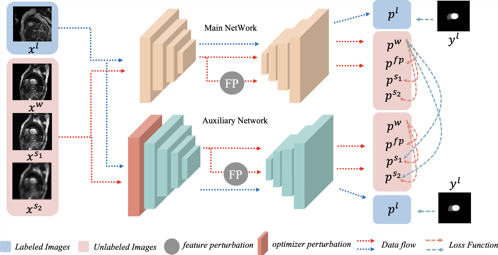
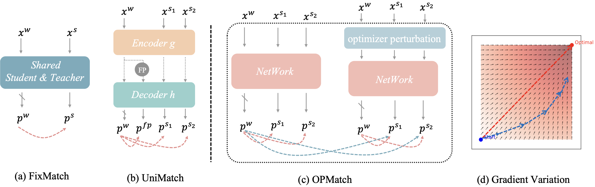
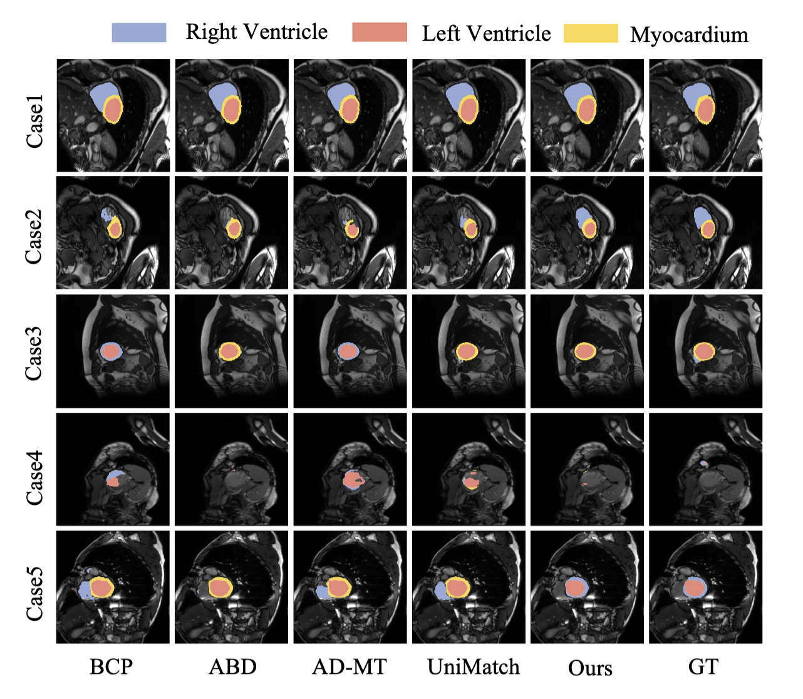

# OPMatch:Optimizer Perturbation-Driven Consistency Regularization for Semi-Supervised Image Segmentation

## The Frame of OPMatch


We compare our method with other method


## Vis on the Himmelblau Function

Here, red represents the gradient change without noise, and blue represents the gradient change with noise.


##  Apply our method to other SOTA methods
As demonstrated in Table X, our OPMatch (★) exhibits framework-agnostic characteristics: **When deployed with stronger base frameworks (e.g., achieving 90.5% in the 7 Cases scenario), OPMatch demonstrates scalable performance gains — the more robust the host framework, the more substantial the marginal improvement. **This empirically validates our core proposition: OPMatch's "perturbation-invariant" design fundamentally transcends the framework-specific limitations of conventional approaches, establishing it as a universal performance amplifier for semi-supervised learning systems.

| Method          | 3 Cases<br>(%) | 7 Cases<br>(%) | Δ (3 Cases) | Δ (7 Cases) |
|-----------------|:--------------:|:--------------:|:-----------:|:-----------:|
| FixMatch        | 63.8           | 86.1           | +0.0        | +0.0        |
| **OPMatch** (★) | 89.3           | 90.2           | **+25.5**   | **+4.1**    |
| UniMatch        | 84.4           | 88.1           | +20.6       | +2.0        |
| **OPMatch** (★) | 89.7           | 90.5           | **+25.9**   | **+4.4**    |
| BCP             | 87.6           | 88.8           | +23.8       | +2.7        |
| **OPMatch** (★) | 88.1           | 89.7           | **+24.3**   | **+3.6**    |

## Run our code
ACDC:
```
cd ACDC
bash scripts/train.sh 1 12366
```

Pancreas:
```
cd Pancreas
cd code
bash train_opmatch.sh 1 12366
```

## Experiment


### ACDC Dataset
- Code path: *[train for ACDC](https://github.com/magic-fortune/OPMatch/blob/main/ACDC/train_opmatch.py)*
- Outcome:

| Method       | Year       | \#Lab.  | DSC↑     | mIoU↑   | 95HD↓   | ASD↓    |
|--------------|------------|----------|----------|---------|---------|---------|
| U-Net        |            | 3 (5%)   | 47.83    | 37.01   | 31.16   | 12.62   |
| U-Net        |            | 7 (10%)  | 79.41    | 68.11   | 9.35    | 2.70    |
| U-Net        |            | 70 (All) | 91.44    | 84.59   | 4.30    | 0.99    |
| UA-MT        | MICCAI'19  | 3 (5%)   | 46.04    | 35.97   | 20.08   | 7.75    |
| SASSNet      | MICCAI'20  |          | 57.77    | 46.14   | 20.05   | 6.06    |
| DTC          | AAAI'21    |          | 56.90    | 45.67   | 23.36   | 7.39    |
| MC-Net       | MICCAI'21  |          | 62.85    | 52.29   | 7.62    | 2.33    |
| URPC         | MedIA'22   |          | 55.87    | 44.64   | 13.60   | 3.74    |
| SS-Net       | MICCAI'22  |          | 65.82    | 55.38   | 6.67    | 2.28    |
| DMD          | MICCAI'23  |          | 80.60    | 69.08   | 5.96    | 1.90    |
| UniMatch     | CVPR'23    |          | 84.38    | 75.54   | 5.06    | 1.04    |
| BCP          | CVPR'23    |          | 87.59    | 78.67   | 1.90    | 0.67    |
| CPC-SAM      | MICCAI'24  |          | 87.95    | 79.01   | 5.80    | 1.54    |
| AD-MT        | ECCV'24    |          | 88.75    | 80.41   | 1.48    | 0.50    |
| ABD          | CVPR'24    |          | 88.96    | 80.70   | 1.57    | 0.52    |
| **Ours**     |            |          | **89.72**| **83.32**| **1.41**| **0.38**|
| UA-MT        | MICCAI'19  | 7 (10%)  | 81.65    | 70.64   | 6.88    | 2.02    |
| SASSNet      | MICCAI'20  |          | 84.50    | 74.34   | 5.42    | 1.86    |
| DTC          | AAAI'21    |          | 84.29    | 73.92   | 12.81   | 4.01    |
| MC-Net       | MICCAI'21  |          | 86.44    | 77.04   | 5.50    | 1.84    |
| URPC         | MedIA'22   |          | 83.10    | 72.41   | 4.84    | 1.53    |
| SS-Net       | MICCAI'22  |          | 86.78    | 77.67   | 6.07    | 1.40    |
| DMD          | MICCAI'23  |          | 87.52    | 78.62   | 4.81    | 1.60    |
| UniMatch     | CVPR'23    |          | 88.08    | 80.10   | 2.09    | 0.45    |
| BCP          | CVPR'23    |          | 88.84    | 80.62   | 3.98    | 1.17    |
| MOST         | MICCAI'24  |          | 89.29    | 81.23   | 3.28    | 0.98    |
| AD-MT        | ECCV'24    |          | 89.46    | 81.47   | 1.51    | 0.44    |
| ABD          | CVPR'24    |          | 89.81    | 81.95   | 1.46    | 0.49    |
| **Ours**     |            |          | **90.50**    | **83.42**   | **1.24**    | **0.31**|

We demonstrated the prediction results of our method on the ACDC dataset with 5% labels.As shown below：



## Pancrease-NIH Dataset
-  Code path: *[train for Pancreas](https://github.com/magic-fortune/OPMatch/blob/main/Pancreas/code/train_opmatch.py)*
- Outcome:
Here is the table written in the requested format:

| Method       | Year       | \#Lab.  | DSC↑     | mIoU↑   | 95HD↓   | ASD↓    |
|--------------|------------|----------|----------|---------|---------|---------|
| V-Net        |            | 6 (10%)  | 42.56    | 36.71   | 42.61   | 11.68   |
| V-Net        |            | 62 (All) | 77.84    | 64.78   | 8.92    | 3.73    |
| UA-MT        | MICCAI'19  | 6 (10%)  | 53.07    | 38.90   | 25.11   | 9.22    |
| SASSNet      | MICCAI'20  |          | 56.23    | 41.98   | 26.16   | 8.97    |
| DTC          | AAAI'21    |          | 59.54    | 45.61   | 16.53   | 16.53   |
| PS-MT        | CVPR'21    |          | 76.94    | 62.37   | 13.12   | 3.66    |
| UniMatch     | CVPR'23    |          | 69.90    | 55.13   | 12.94   | 3.56    |
| BCP          | CVPR'23    |          | 73.83    | 59.24   | 12.71   | 3.72    |
| AD-MT        | ECCV'24    |          | 80.21    | 67.51   | **7.18**| **1.66**|
| **Ours**     |            |          | **80.42**| **67.61**| 10.72   | 2.29    |


## Acknowledgement
We extend our heartfelt gratitude to *[UniMatch](https://github.com/LiheYoung/UniMatch/blob/main/unimatch.py)* for providing the code, which has been invaluable to our work.


