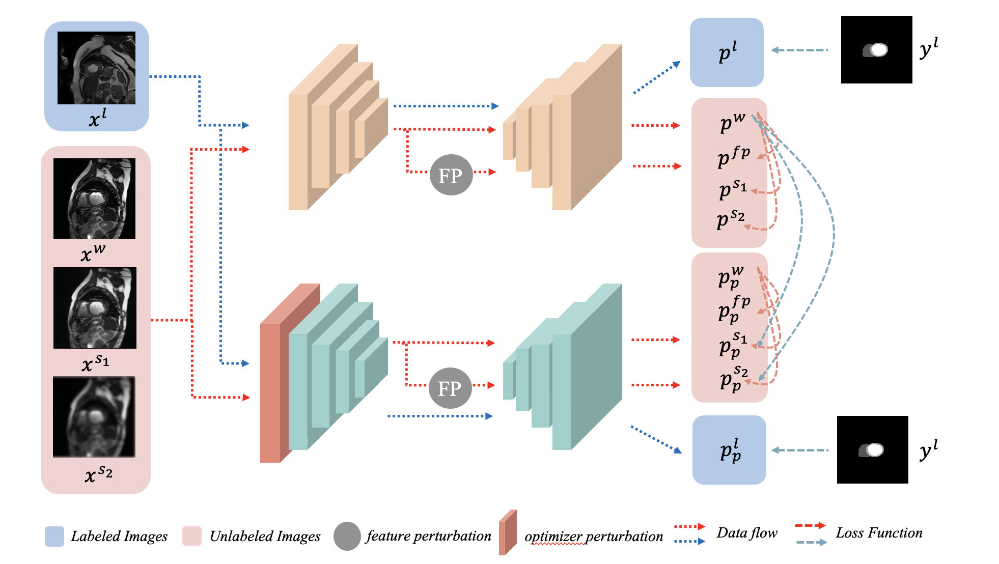

# OPMatch:Optimizer Perturbation-Driven Consistency Regularization for Semi-Supervised Image Segmentation

## the Frame of OPMatch

## We compare our method with other method

## Experiment

### ACDC Dataset

- Code path:
- Dataset links: 
- Outcome:

## Pancrease-NIH Dataset

- Code path:
- Dataset links:
- Outcome:

## Conclusion

